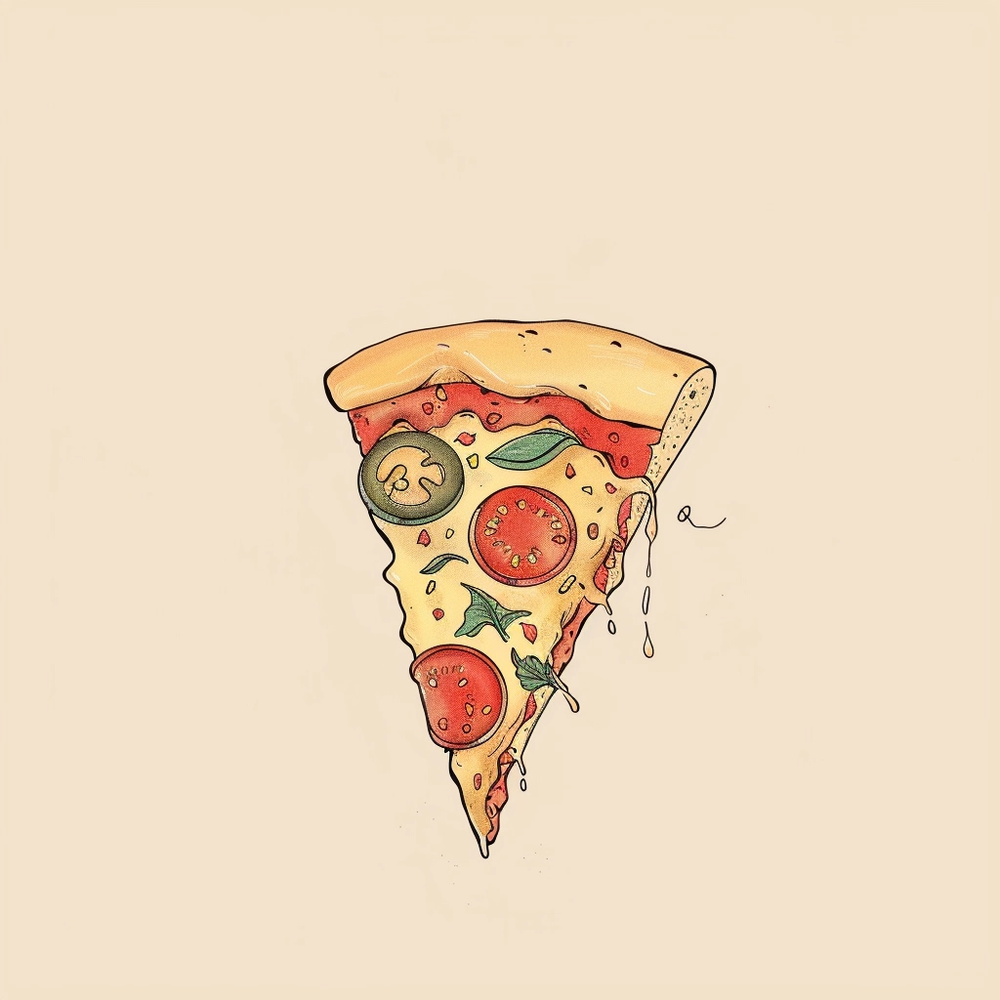
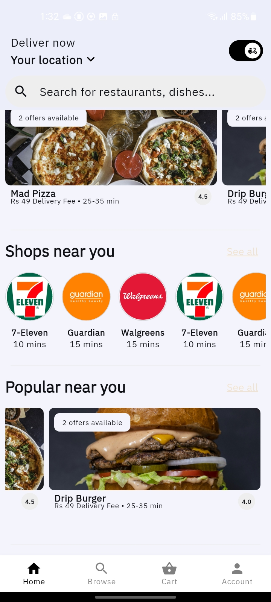
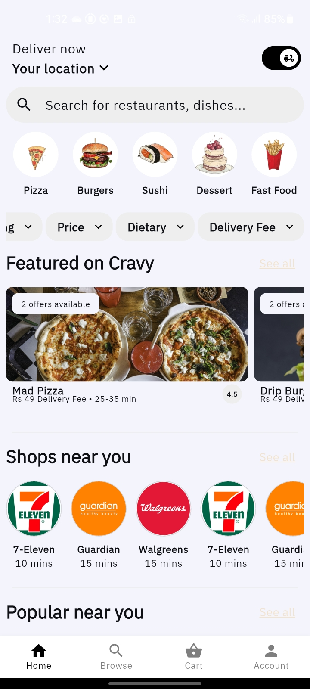
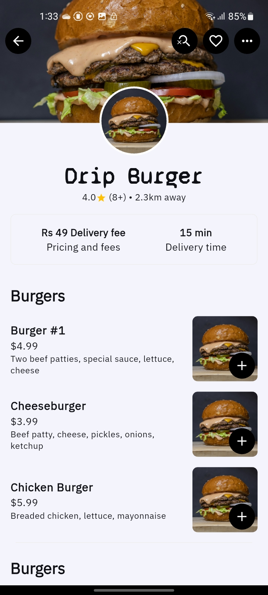
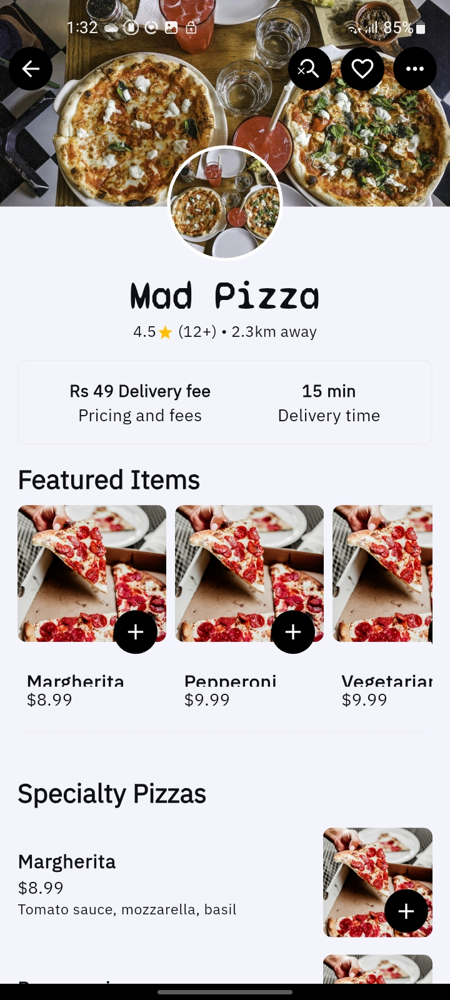
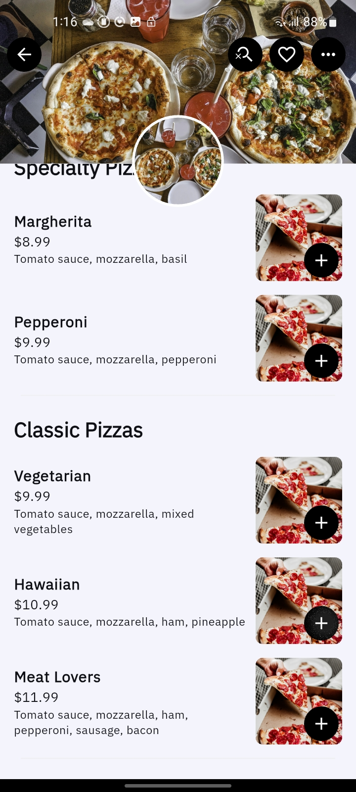
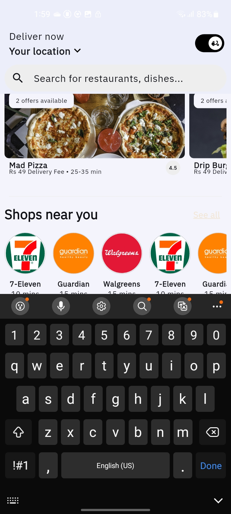

<!-- Cravy App Overview -->
<h1>Cravy</h1>

<table>
  <tr>
    <td>
      
    </td>
    <td>
      <strong>Cravy</strong> is a modern food delivery application that brings a seamless and delightful ordering experience to your fingertips.  
      It replicates core industry-standard design patterns and features found in popular food delivery platforms — making it both familiar and efficient for users.
    </td>
  </tr>
</table>

<!-- App Screenshots Showcase -->
<h2>📸 App Screenshots</h2>

<table>
  <tr>
    <td style="text-align: center;">
       
      <strong>Home Screen</strong> 
      A clean and aesthetic home screen for the Cravy food delivery app displaying all the restaurant options near you along with restaurant search option 
    </td>
    <td style="text-align: center;">
       
      <strong>Home Page Bottom</strong> 
      Explore curated restaurants, trending dishes, and personalized recommendations all in one place.
    </td>
    <td style="text-align: center;">
       
      <strong>Burger Restaurant</strong> 
      Browse rich menus with mouth-watering burger visuals and easy navigation across food categories.
    </td>
  </tr>
  <tr>
    <td style="text-align: center;">
      
       
      <strong>Pizza Outlet</strong>
    </td>
    <td style="text-align: center;">
      
       
      <strong>Pizza Menu</strong>
    </td>
    <td style="text-align: center;">
      
       
      <strong>Restaurant Search Screen</strong>
    </td>
  </tr>

  
</table>
